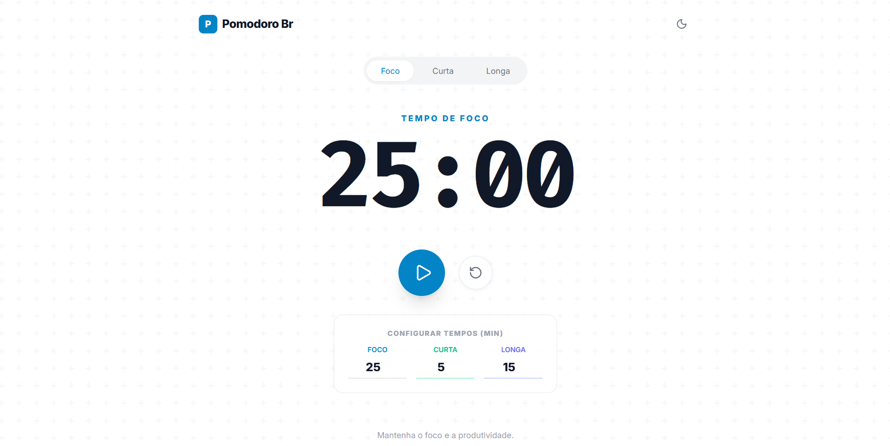

# 🍅 Pomodoro Br

Uma aplicação web moderna, minimalista e responsiva da Técnica Pomodoro, desenvolvida para ajudar no foco e produtividade. O projeto utiliza **HTML5**, **JavaScript (ES6)** e **Tailwind CSS** para estilização.


## 📸 Demonstração



## ✨ Funcionalidades

* **3 Modos de Timer:**
    * 🧠 **Foco:** Padrão de 25 minutos (Tema Azul).
    * ☕ **Pausa Curta:** Padrão de 5 minutos (Tema Verde/Emerald).
    * 🎮 **Pausa Longa:** Padrão de 15 minutos (Tema Roxo/Indigo).
* **Personalização em Tempo Real:** Inputs numéricos permitem alterar a duração de cada modo instantaneamente.
* **Tema Escuro/Claro:** Alternância completa de tema com persistência visual e transições suaves.
* **Alarme Sonoro Nativo:** Utiliza a **Web Audio API** do navegador para gerar os beeps de alarme (sem necessidade de arquivos .mp3 externos).
* **Interface Responsiva:** Funciona perfeitamente em desktops, tablets e celulares.
* **Feedback Visual:** A cor da interface muda sutilmente dependendo do modo selecionado para indicar o estado atual.
* **Modo Foco (Anti-Distração):** Desabilita o menu de contexto (botão direito) e atalhos de desenvolvedor (F12, Ctrl+Shift+I) para evitar interrupções acidentais.

## 🛠️ Tecnologias Utilizadas

* **HTML5 Semântico**: Estrutura da página.
* **Tailwind CSS (via CDN)**: Estilização utilitária rápida e sistema de cores.
* **JavaScript (Vanilla)**: Lógica do timer, manipulação do DOM e AudioContext.
* **Lucide Icons**: Ícones leves e modernos (via script).
* **Google Fonts**: Fontes *Inter* (interface) e *Fira Code* (timer monoespaçado).

## 🚀 Como Rodar o Projeto

Como este projeto utiliza tecnologias web padrão e CDNs, não é necessário instalar dependências (como Node.js ou NPM).

1.  **Clone o repositório:**
    ```bash
    git clone [https://github.com/SEU-USUARIO/pomodoro-br.git](https://github.com/SEU-USUARIO/pomodoro-br.git)
    ```
2.  **Abra a pasta do projeto.**
3.  **Execute:**
    * Basta clicar duas vezes no arquivo `index.html` para abrir no seu navegador padrão.
    * Ou, se usar o VS Code, utilize a extensão "Live Server".

